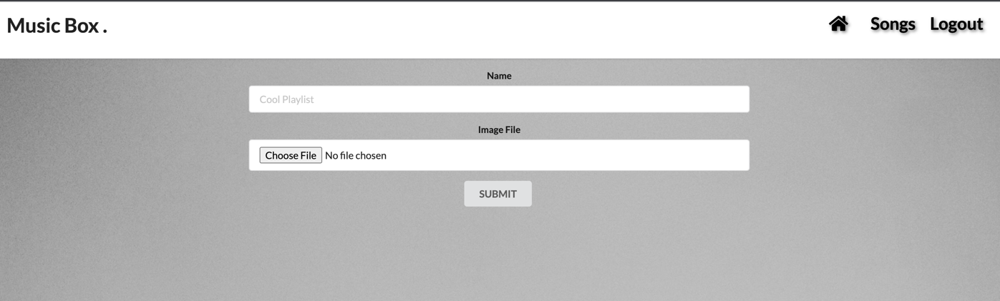

# Music Box

Music sharing and Streaming web application.
This full-stack web app allows users to share and stream their favorite audio files. Users can create playlists, upload audio files, and explore other users' collections.

##### Technologies: MERN (MongoDB, Express, React, Node.js, React Semantic UI)

#### Features
User authentication and authorization using JWT tokens.
User home page to manage uploaded audio files and playlists.
Audio file upload with support for mp3 file formats.
Playlist creation and management.
Audio streaming with player controls (play, pause).

#### Screenshot
Signup Page

Login Page

Playlist Page (Homepage)

Add Playlist Detail Page

Add Playlist Form

Song List Page

Upload Song Form

#### Getting Started:
[Trello](https://trello.com/b/6v0txBjE/music-box)

[Music Box](http://localhost:8000/)

#### Next Steps: 

Planned future enhancements:
* Re-style the app 
* Need to setup functionality to delete playlist 
* Need to setup functionality to add an image when create a new song, upload all the image to s3 AWS

